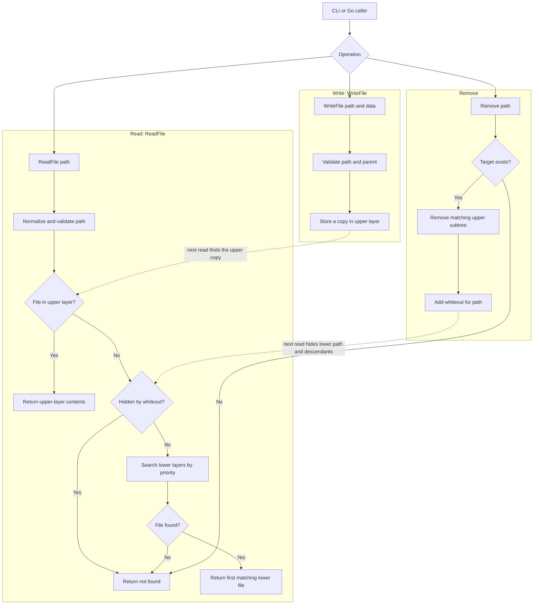

# LayerFS Simulator

LayerFS is an in-memory Go simulator for the core behavior of a layered
copy-on-write filesystem inspired by Linux OverlayFS. It combines read-only
lower layers with a writable upper layer, resolves files into a merged view,
and records deletions as whiteouts. It does not mount a real filesystem or
modify the host filesystem.

## Features

- Ordered immutable lower layers (first layer has highest priority).
- Writable upper layer; writes shadow lower-layer files without changing them.
- Merged directory listings and sorted visible-file output.
- Whiteouts for removed files and directory subtrees.
- Path normalization and checks against traversal and file/directory conflicts.
- Interactive command-line demo and Go library API.

## How it works

The merged filesystem reads the writable upper layer first. If there is no
upper copy, it checks whiteouts and then searches lower layers from highest to
lowest priority. Writes go only to the upper layer; removals create whiteouts
so lower-layer files stay unchanged but disappear from the merged view.



## Requirements

- Go 1.22 or newer.

## Run the simulator

From this directory, start the interactive demo:

```sh
go run ./cmd/layerfs
```

Available commands:

```text
ls [path]                 List the merged root or a directory
cat <path>                Read a file
write <path> <text>       Write a file into the upper layer
rm <path>                 Hide a file or directory with a whiteout
layers                    Show visible files, upper files, and whiteouts
help                      Show the command list
exit                      Quit
```

Try `cat etc/app.conf`, then `write etc/app.conf theme=dark` and `cat etc/app.conf`.
The second read comes from the upper layer while the lower-layer copy remains
unchanged. Run `layers` to inspect the merged result and upper-layer state.

## Library example

```go
package main

import (
	"fmt"

	layerfs "github.com/anouaressa/layerfs-simulator"
)

func main() {
	fs := layerfs.New(
		layerfs.Layer{"etc/app.conf": []byte("theme=light\n")},
		layerfs.Layer{"etc/app.conf": []byte("theme=default\n")},
	)

	data, _ := fs.ReadFile("/etc/app.conf") // reads highest-priority lower layer
	fmt.Print(string(data))
	_ = fs.WriteFile("etc/app.conf", []byte("theme=dark\n")) // copy-on-write
	_ = fs.Remove("etc/app.conf") // hides it from the merged view
	fmt.Println(fs.Whiteouts())
}
```

The public API is `New`, `ReadFile`, `WriteFile`, `Remove`, `ReadDir`,
`VisibleFiles`, `UpperFiles`, and `Whiteouts`. Returned file data is copied to
prevent callers from mutating filesystem state outside `WriteFile`.

## Test

```sh
go test ./...
go vet ./...
```

See [design.md](design.md) for the data model, operation semantics, invariants,
and limitations.
